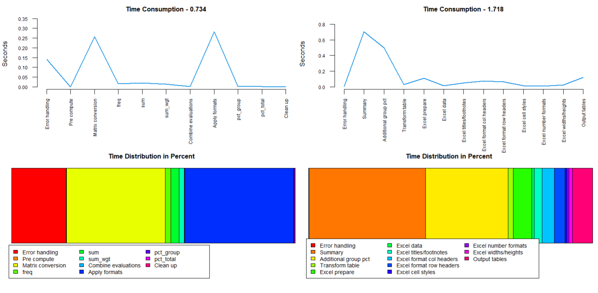

<!-- README.md is generated from README.Rmd. Please edit that file -->

```{r, include = FALSE}
knitr::opts_chunk$set(
  collapse = TRUE,
  comment = "#>",
  fig.path = "man/figures/README-",
  out.width = "100%"
)
```

# qol - Quality of Life 

<!-- badges: start -->
[](https://github.com/s3rdia/qol)
[](https://cran.r-project.org/package=qol)
[](https://github.com/s3rdia/qol)
[](https://cran.r-project.org/web/checks/check_results_qol.html)
<!-- badges: end -->

Bringing Powerful 'SAS' Inspired Concepts for more Efficient Bigger Outputs to 'R'.

The main goal is to make descriptive evaluations easier to create bigger and more complex outputs in less time with less code. Introducing format containers with multilabels, a more powerful summarise which is capable to output every possible combination of the provided grouping variables in one go, tabulation functions which can create any table in different styles and other more readable functions. The code is optimized to work fast even with datasets of over a million observations.

## Installation

```{r, eval = FALSE}
# Official release
install.packages("qol")

# Development version
devtools::install_github("s3rdia/qol")
pak::pak("s3rdia/qol")
```

## Format Containers

Create a format container independent from any data frame. Define which values should be recoded into which new categories, if the format is applied to a variable in a data frame. It is possible to assign a single value to multiple new categories to create a multilabel.
With these format containers, you just keep a small reference of original values and result categories. Formats and data find their way together only just before computing the results. This method is very memory efficient, readable and user friendly for creating larger and more complex outputs at the same time.

```{r formats, eval = FALSE}
library(qol)

# Creating format containers
age. <- discrete_format(
    "Total"          = 0:100,
    "under 18"       = 0:17,
    "18 to under 25" = 18:24,
    "25 to under 55" = 25:54,
    "55 to under 65" = 55:64,
    "65 and older"   = 65:100)

sex. <- discrete_format(
    "Total"  = 1:2,
    "Male"   = 1,
    "Female" = 2)
```

## Massive Outputs: Simple and fast

The package builds on the incredibly fast [collapse](https://github.com/SebKrantz/collapse) and [data.table](https://github.com/Rdatatable/data.table) packages. In addition the code is optimized to handle big datasets efficiently with the format concept.

```{r speed, eval = FALSE}
library(qol)

# If you want to test the raw speed in combination with creating big outputs try this:
# Lets crank up the observations to 10 Millions
my_data <- dummy_data(10000000)

# Create format containers
age. <- discrete_format(
    "Total"          = 0:100,
    "under 18"       = 0:17,
    "18 to under 25" = 18:24,
    "25 to under 55" = 25:54,
    "55 to under 65" = 55:64,
    "65 and older"   = 65:100)

sex. <- discrete_format(
    "Total"  = 1:2,
    "Male"   = 1,
    "Female" = 2)

education. <- discrete_format(
    "Total"            = c("low", "middle", "high"),
    "low education"    = "low",
    "middle education" = "middle",
    "high education"   = "high")
	
# And now let's take a second and see what massive outputs we can get in no time
summary_df <- my_data |>
    summarise_plus(class      = c(year, sex, age, education),
                   values     = c(income, probability, weight),
                   statistics = c("freq", "sum", "sum_wgt", "pct_group", "pct_total", "missing"),
                   formats    = list(age = age.,
                                     sex = sex.,
                                     education = education.),
                   weight     = "weight",
                   nesting    = "all",
                   notes      = FALSE)
```


The operations based on summarisation are the fastest. Other operations take a bit longer but still work fast with big datasets.

## Powerful tabulation

Using the wonderful [openxlsx2](https://github.com/JanMarvin/openxlsx2) package for maximum style, you can basically output any table fully styled with little effort. Combine any number of variables in any possible way, all at once. Setting up a custom, reusable style is as easy as setting up options like: provide a color for the table header, set the font size for the row header, should borders be drawn for the table cells yes/no, and so on.
You can fully concentrate on designing a table, instead of thinking hard about how to calculate where to put a border or to even manually prepare a designed workbook.

```{r tabulation, eval = FALSE}
library(qol)

my_data <- dummy_data(100000)

# Create format containers
age. <- discrete_format(
    "Total"          = 0:100,
    "under 18"       = 0:17,
    "18 to under 25" = 18:24,
    "25 to under 55" = 25:54,
    "55 to under 65" = 55:64,
    "65 and older"   = 65:100)

sex. <- discrete_format(
    "Total"  = 1:2,
    "Male"   = 1,
    "Female" = 2)

education. <- discrete_format(
    "Total"            = c("low", "middle", "high"),
    "low education"    = "low",
    "middle education" = "middle",
    "high education"   = "high")
	
# Define style
my_style <- excel_output_style(column_widths = c(2, 15, 15, 15, 9))

# Define titles and footnotes. If you want to add hyperlinks you can do so by
# adding "link:" followed by the hyperlink to the main text.
titles <- c("This is title number 1 link: https://cran.r-project.org/",
            "This is title number 2",
            "This is title number 3")
footnotes <- c("This is footnote number 1",
               "This is footnote number 2",
               "This is footnote number 3 link: https://cran.r-project.org/")

# Output complex tables with different percentages
my_data |> any_table(rows       = c("sex + age", "sex", "age"),
                     columns    = c("year", "education + year"),
                     values     = weight,
                     statistics = c("sum", "pct_group"),
                     pct_group  = c("sex", "age"),
                     formats    = list(sex = sex., age = age.,
                                       education = education.),
                     titles     = titles,
                     footnotes  = footnotes,
                     style      = my_style,
                     na.rm      = TRUE)
```


You can also combine multiple tables in one workbook, each on a different sheet, and save the file, instead of just viewing it.

```{r save_file, eval = FALSE}
my_style <- my_style |> modify_output_style(sheet_name = "age_sex")

# Capture the output of any_table() to get a list which contains the data frame
# as well as the formatted workbook.
# Note: You can set print to FALSE to prevent the workbook from opening.
result_list <- my_data |>
           any_table(rows       = c("age"),
                     columns    = c("sex"),
                     values     = weight,
                     statistics = c("sum"),
                     formats    = list(sex = sex., age = age.),
                     style      = my_style,
                     na.rm      = TRUE,
                     print      = FALSE)

# Set a new sheet name and define where the final workbook should be saved
my_style <- my_style |> modify_output_style(sheet_name = "edu_year",
                                            file       = "C:/My_folder/My_workbook.xlsx")

# Pass on the workbook from before to the next any_table()
my_data |> any_table(workbook   = result_list[["workbook"]],
                     rows       = c("education"),
                     columns    = c("year"),
                     values     = weight,
                     statistics = c("pct_group"),
                     formats    = list(education = education.),
                     style      = my_style,
                     na.rm      = TRUE)
					 
# For safety set file back to NULL at the end. Otherwise the next any_table() will overwrite
# the existing file.
my_style <- my_style |> modify_output_style(file = NULL)
```


In case you have a good amount of tables, you want to combine in a single workbook, you can also catch the outputs and combine them afterwards in one go:

```{r combine_file, eval = FALSE}
my_style <- my_style |> modify_output_style(sheet_name = "age_sex")

# Catch the output as shown before, but additionally use the option -> output = "excel_nostyle".
# This skips the styling part, so that the function runs faster. The styling is done later on.
tab1 <- my_data |>
       any_table(rows       = c("age"),
                 columns    = c("sex"),
                 values     = weight,
                 statistics = c("sum"),
                 formats    = list(sex = sex., age = age.),
                 style      = my_style,
                 na.rm      = TRUE,
                 print      = FALSE,
                 output     = "excel_nostyle")

# Now let's asume you create a bunch of different tables
my_style <- my_style |> modify_output_style(sheet_name = "sheet2")
tab2     <- my_data  |> any_table(..., print = FALSE, output = "excel_nostyle")

my_style <- my_style |> modify_output_style(sheet_name = "sheet3")
tab3     <- my_data  |> any_table(..., print = FALSE, output = "excel_nostyle")

my_style <- my_style |> modify_output_style(sheet_name = "sheet4")
tab4     <- my_data  |> any_table(..., print = FALSE, output = "excel_nostyle")

...

# Every of the above tabs is a list, which contains the data table, an unstyled workbook and the meta
# information needed for the individual styling. These tabs can be input into the following function,
# which reads the meta information, styles each table individually and combines them as separate sheets
# into a single workbook.
combine_into_workbook(tab1, tab2, tab3, tab4, tab5, tab6, tab7, tab8,
                      file = "C:/My_folder/My_workbook.xlsx")
```

## Readability

There are also some functions which enhance the readability of the code. For example if - else if - else statements like in other languages:

```{r readability, eval = FALSE}
library(qol)

# Example data frame
my_data <- dummy_data(1000)

# Call function
new_df <- my_data |>
         if.(age < 18,             age_group = "under 18") |>
    else_if.(age >= 18 & age < 65, age_group = "18 to under 65") |>
    else.   (                      age_group = "65 and older")

# Or with multiple variables
new_df <- my_data |>
         if.(age < 18,             age_group = "under 18"      , age_num = 1L) |>
    else_if.(age >= 18 & age < 65, age_group = "18 to under 65", age_num = 2L) |>
    else.   (                      age_group = "65 and older",   age_num = 3L)

# NOTE: As in other languages the following if blocks won't produce the same result.
#       if.() will overwrite existing values while else_if.() will not.
state_df <- my_data |>
         if.(state == 1, state_a = "State 1") |>
    else_if.(state < 11, state_a = "West") |>
    else.   (            state_a = "East")

state_df <- state_df |>
      if.(state == 1, state_b = "State 1") |>
      if.(state < 11, state_b = "West") |>
    else.(            state_b = "East")
```

## Monitoring

This package also includes some basic yet very effective performance monitoring functions. The heavier functions in this package already make use of them and can show how they work internally like this:




## Customizing Visual Appearance

Don't like the colors of the built-in in RStudio themes? Can't find a theme online that fits your liking? No Problem. With a simple function you can create a full theme file and decide which parts of the editor receive which colors. The themes shown below and the corresponding code can be found on GitHub.


