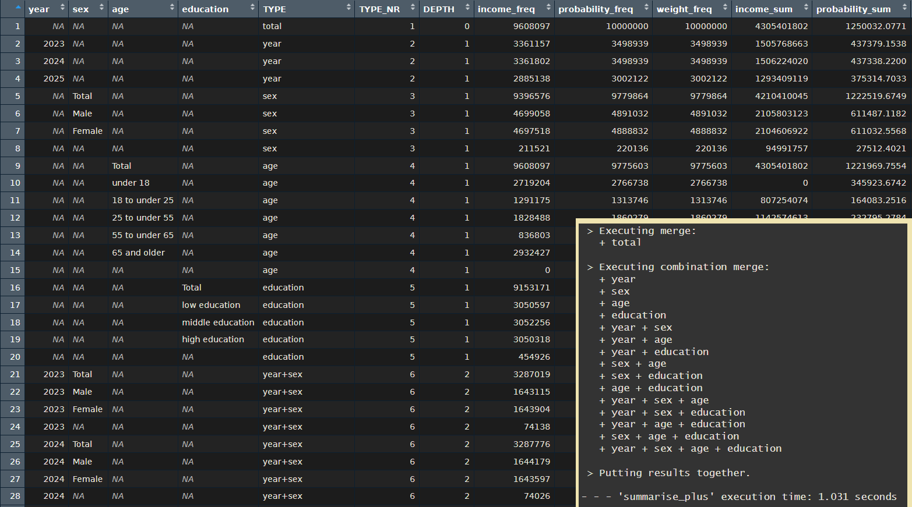

<!-- README.md is generated from README.Rmd. Please edit that file -->

# qol - Quality of Life 

<!-- badges: start -->

<!-- badges: end -->

Bringing Powerful ‘SAS’ Inspired Concepts for more Efficient Bigger
Outputs to ‘R’.

The main goal is to make descriptive evaluations easier to create bigger
and more complex outputs in less time with less code. Introducing format
containers with multilabels, a more powerful summarise which is capable
to output every possible combination of the provided grouping variables
in one go, tabulation functions which can create any table in different
styles and other more readable functions. The code is optimized to work
fast even with datasets of over a million observations.

## Installation

You can install the development version of qol like so:

``` r
devtools::install_github("s3rdia/qol")
pak::pak("s3rdia/qol")
```

## Format Containers

Create a format container independent from any data frame. Define which
values should be recoded into which new categories, if the format is
applied to a variable in a data frame. It is possible to assign a single
value to multiple new categories to create a multilabel. With these
format containers, you just keep a small reference of original values
and result categories. Formats and data find their way together only
just before computing the results. This method is very memory efficient,
readable and user friendly for creating larger and more complex outputs
at the same time.

``` r
library(qol)

# Creating format containers
age. <- discrete_format(
    "Total"          = 0:100,
    "under 18"       = 0:17,
    "18 to under 25" = 18:24,
    "25 to under 55" = 25:54,
    "55 to under 65" = 55:64,
    "65 and older"   = 65:100)

sex. <- discrete_format(
    "Total"  = 1:2,
    "Male"   = 1,
    "Female" = 2)
```

## Massive Outputs: Simple and fast

The package builds on the incredibly fast
[collapse](https://github.com/SebKrantz/collapse) and
[data.table](https://github.com/Rdatatable/data.table) packages. In
addition the code is optimized to handle big datasets efficiently with
the format concept.

``` r
library(qol)

# If you want to test the raw speed in combination with creating big outputs try this:
# Lets crank up the observations to 10 Millions
my_data <- dummy_data(10000000)

# Create format containers
age. <- discrete_format(
    "Total"          = 0:100,
    "under 18"       = 0:17,
    "18 to under 25" = 18:24,
    "25 to under 55" = 25:54,
    "55 to under 65" = 55:64,
    "65 and older"   = 65:100)

sex. <- discrete_format(
    "Total"  = 1:2,
    "Male"   = 1,
    "Female" = 2)

education. <- discrete_format(
    "Total"            = c("low", "middle", "high"),
    "low education"    = "low",
    "middle education" = "middle",
    "high education"   = "high")
    
# And now let's take a second and see what massive outputs we can get in no time
summary_df <- my_data |>
    summarise_plus(class      = c(year, sex, age, education),
                   values     = c(income, probability, weight),
                   statistics = c("freq", "sum", "sum_wgt", "pct_group", "pct_total", "missing"),
                   formats    = list(age = age.,
                                     sex = sex.,
                                     education = education.),
                   weight     = "weight",
                   nesting    = "all",
                   notes      = FALSE)
```



The operations based on summarisation are the fastest. Other operations
take a bit longer but still work fast with big datasets.

## Powerful tabulation

Using the wonderful [openxlsx2](https://github.com/JanMarvin/openxlsx2)
package for maximum style, you can basically output any table fully
styled with little effort. Combine any number of variables in any
possible way, all at once. Setting up a custom, reusable style is as
easy as setting up options like: provide a color for the table header,
set the font size for the row header, should borders be drawn for the
table cells yes/no, and so on. You can fully concentrate on designing a
table, instead of thinking hard about how to calculate where to put a
border or to even manually prepare a designed workbook.

``` r
library(qol)

my_data <- dummy_data(100000)

# Create format containers
age. <- discrete_format(
    "Total"          = 0:100,
    "under 18"       = 0:17,
    "18 to under 25" = 18:24,
    "25 to under 55" = 25:54,
    "55 to under 65" = 55:64,
    "65 and older"   = 65:100)

sex. <- discrete_format(
    "Total"  = 1:2,
    "Male"   = 1,
    "Female" = 2)

education. <- discrete_format(
    "Total"            = c("low", "middle", "high"),
    "low education"    = "low",
    "middle education" = "middle",
    "high education"   = "high")
    
# Define style
my_style <- excel_output_style(column_widths = c(2, 15, 15, 15, 9))

# Define titles and footnotes. If you want to add hyperlinks you can do so by
# adding "link:" followed by the hyperlink to the main text.
titles <- c("This is title number 1 link: https://cran.r-project.org/",
            "This is title number 2",
            "This is title number 3")
footnotes <- c("This is footnote number 1",
               "This is footnote number 2",
               "This is footnote number 3 link: https://cran.r-project.org/")

# Output complex tables with different percentages
my_data |> any_table(rows       = c("sex + age", "sex", "age"),
                     columns    = c("year", "education + year"),
                     values     = weight,
                     statistics = c("sum", "pct_group"),
                     pct_group  = c("sex", "age"),
                     formats    = list(sex = sex., age = age.,
                                       education = education.),
                     titles     = titles,
                     footnotes  = footnotes,
                     style      = my_style,
                     na.rm      = TRUE)
```


## Readability

There are also some functions which enhance the readability of the code.
For example if - else if - else statements like in other languages:

``` r
library(qol)

# Example data frame
my_data <- dummy_data(1000)

# Call function
new_df <- my_data |>
         if.(age < 18,             age_group = "under 18") |>
    else_if.(age >= 18 & age < 65, age_group = "18 to under 65") |>
    else.   (                      age_group = "65 and older")

# Or with multiple variables
new_df <- my_data |>
         if.(age < 18,             age_group = "under 18"      , age_num = 1L) |>
    else_if.(age >= 18 & age < 65, age_group = "18 to under 65", age_num = 2L) |>
    else.   (                      age_group = "65 and older",   age_num = 3L)

# NOTE: As in other languages the following if blocks won't produce the same result.
#       if.() will overwrite existing values while else_if.() will not.
state_df <- my_data |>
         if.(state == 1, state_a = "State 1") |>
    else_if.(state < 11, state_a = "West") |>
    else.   (            state_a = "East")

state_df <- state_df |>
      if.(state == 1, state_b = "State 1") |>
      if.(state < 11, state_b = "West") |>
    else.(            state_b = "East")
```

## Monitoring

This package also includes some basic yet very effective performance
monitoring functions. The heavier functions in this package already make
use of them and can show how they work internally like this:


